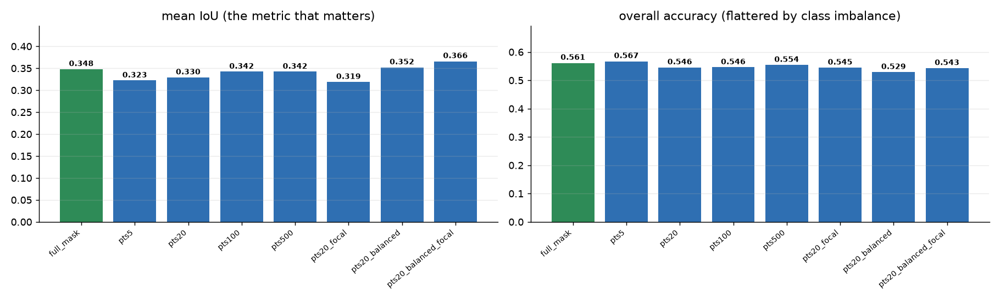
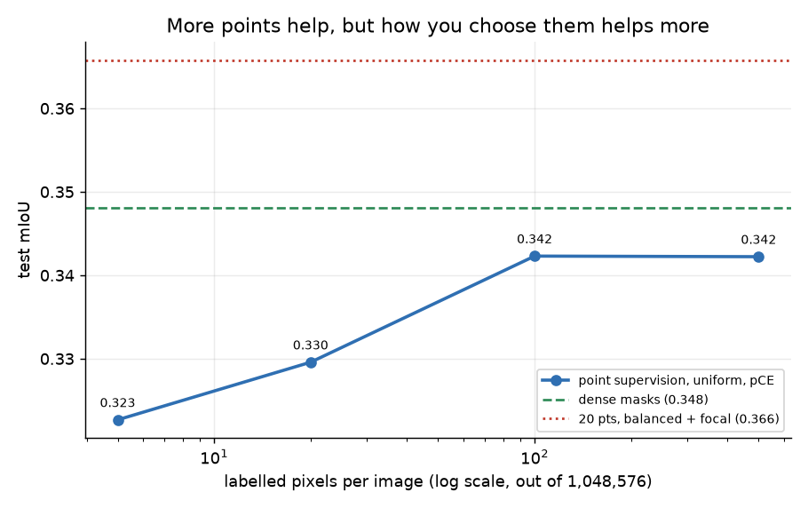
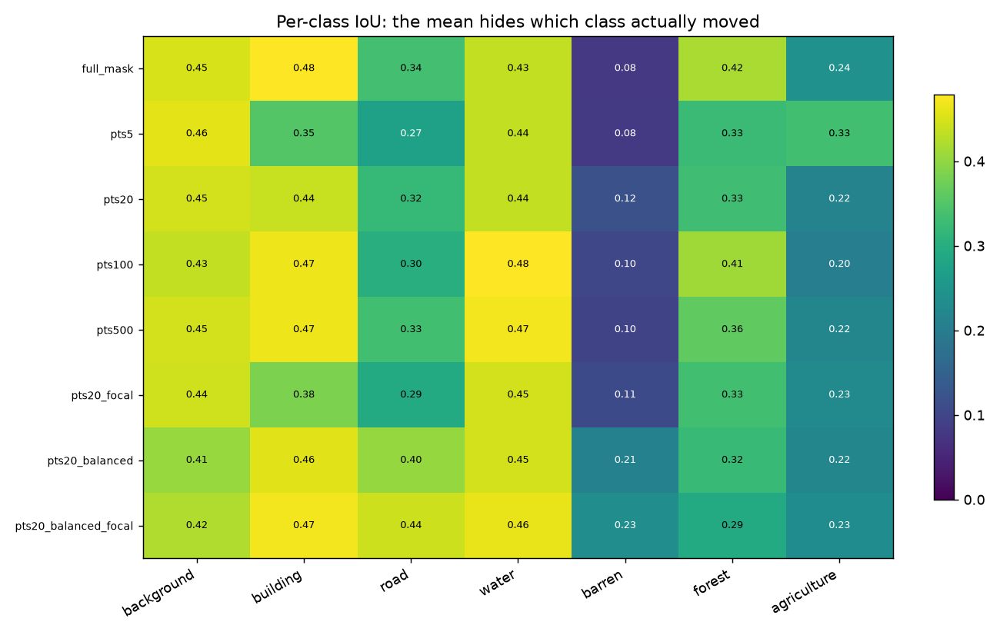
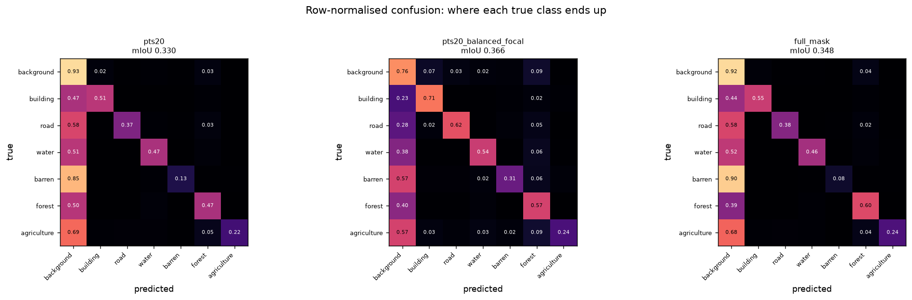

# Point-supervised segmentation of aerial imagery with partial cross-entropy

**How much accuracy do you lose if you label twenty pixels per image instead of a million?**

Dense segmentation masks are the most expensive label in computer vision. A single 1024x1024
aerial image has 1,048,576 labelled pixels, and someone has to draw every boundary. Point
supervision replaces that with a handful of clicks.

This project implements partial cross-entropy, simulates point annotation on
[LoveDA](https://github.com/Junjue-Wang/LoveDA), and measures what actually drives performance
across eight controlled runs.

The answer was not what I expected.



---

## Headline result

**Twenty well-chosen pixels per image beat the full dense mask.**

| | labelled pixels / image | fraction of the image | test mIoU |
|---|---:|---:|---:|
| Dense masks (upper bound) | 1,048,576 | 100% | 0.3481 |
| **20 points, class-balanced + focal** | **20** | **0.0019%** | **0.3658** |

That is **105.1%** of dense-mask mIoU from **0.002%** of the labels.

Three findings behind it, each measured rather than asserted:

**1. The point budget saturates almost immediately.** Going from 5 points to 500, a hundredfold
increase in annotation cost, moves mIoU from 0.3227 to 0.3422. Five points per image already
reach 92.7% of the dense-mask score.

**2. How you choose the points matters far more than how many.** Twenty class-balanced points
(0.3520) beat five hundred uniformly sampled ones (0.3422). That is **25x fewer labels and a
better result**.

**3. Focal loss only helps once sampling is balanced.** On uniform sampling it *hurts*
(0.3296 to 0.3194). On class-balanced sampling it *helps* (0.3520 to 0.3658). The two choices
interact, and testing either one alone would have given the wrong answer.



---

## All results

Full LoveDA validation set: 1,669 images, dense masks, native 1024x1024. DeepLabV3+ with an
ImageNet-pretrained ResNet-50, 15 epochs per run, single seed, identical settings throughout.

| run | points / image | sampling | loss | mIoU | OA | fwIoU | mF1 |
|---|---:|---|---|---:|---:|---:|---:|
| `full_mask` | all 1,048,576 | dense mask | CE | 0.3481 | 0.5614 | 0.3668 | 0.5001 |
| `pts5` | 5 | uniform | pCE | 0.3227 | 0.5671 | 0.3775 | 0.4752 |
| `pts20` | 20 | uniform | pCE | 0.3296 | 0.5457 | 0.3495 | 0.4835 |
| `pts100` | 100 | uniform | pCE | 0.3423 | 0.5460 | 0.3534 | 0.4938 |
| `pts500` | 500 | uniform | pCE | 0.3422 | 0.5541 | 0.3589 | 0.4947 |
| `pts20_focal` | 20 | uniform | pCE, gamma=2 | 0.3194 | 0.5448 | 0.3484 | 0.4722 |
| `pts20_balanced` | 20 | class-balanced | pCE | 0.3520 | 0.5293 | 0.3461 | 0.5130 |
| **`pts20_balanced_focal`** | **20** | **class-balanced** | **pCE, gamma=2** | **0.3658** | 0.5433 | 0.3598 | **0.5276** |

### Sampling strategy crossed with loss, at a fixed budget of 20 points

|  | pCE (gamma=0) | focal pCE (gamma=2) |
|---|---:|---:|
| uniform | 0.3296 | 0.3194 (**-0.0102**) |
| class-balanced | 0.3520 | **0.3658** (**+0.0138**) |

The sign flips. That interaction is the most interesting thing in these results.

### Per-class IoU: where the gain actually comes from

| run | background | building | road | water | **barren** | forest | agriculture |
|---|---:|---:|---:|---:|---:|---:|---:|
| `full_mask` | 0.450 | 0.479 | 0.335 | 0.434 | **0.079** | 0.417 | 0.242 |
| `pts20` | 0.445 | 0.439 | 0.320 | 0.436 | **0.119** | 0.332 | 0.215 |
| `pts20_balanced` | 0.405 | 0.457 | 0.404 | 0.446 | **0.210** | 0.323 | 0.220 |
| `pts20_balanced_focal` | 0.422 | 0.471 | 0.443 | 0.463 | **0.234** | 0.294 | 0.233 |

The mean hides the mechanism. **Barren**, the rarest class, goes from **0.079 with full dense
masks to 0.234 with twenty balanced points, a 3x improvement.** Road nearly matches it, 0.335 to
0.443.

This is not magic. Dense cross-entropy averages over pixels, so a class occupying a tiny
fraction of the image contributes almost nothing to the gradient and the model learns to ignore
it. Class-balanced point sampling gives every present class the same number of labelled pixels,
which is an implicit, and very effective, class reweighting.

It is also not free. **Forest drops from 0.417 to 0.294.** Common classes lose some of the
gradient share they previously monopolised. The gain is a redistribution, not a free lunch, and
whether it is the right trade depends on whether the rare classes are the ones you care about.



---

## Why mIoU and not accuracy

**Overall accuracy is the wrong metric for this dataset, and reporting it alone would be
misleading.**

Look at the table again. `pts5` has the **highest** overall accuracy of any run, 0.5671, higher
than the dense-mask model. It also has nearly the **lowest** mIoU, 0.3227. Frequency-weighted
IoU agrees with OA and is similarly misleading.

LoveDA is severely imbalanced. Accuracy counts pixels, so a model that predicts the dominant
classes and quietly gives up on barren and road scores well. mIoU averages over *classes*, so a
failed class costs the same as a failed common one and cannot be hidden.

Both are reported everywhere in this repository, side by side, always. mIoU is the number the
work is judged on.



---

## Partial cross-entropy

Standard cross-entropy assumes every pixel has a label. Under point supervision almost none do,
so the question is what to do with the rest. Partial cross-entropy answers it in the simplest
possible way: **average the loss over labelled pixels and ignore everything else.**

$$\mathrm{pCE} = \frac{\sum_i \ell_i M_i}{\sum_i M_i}, \qquad M_i = \begin{cases} 1 & \text{pixel } i \text{ is labelled} \\ 0 & \text{otherwise}\end{cases}$$

with $\ell_i = -\log p_{i,y_i}$, or the focal variant $\ell_i = -(1-p_{i,y_i})^{\gamma}\log p_{i,y_i}$.

Implementation in [`src/pointseg/losses.py`](src/pointseg/losses.py):

```python
def forward(self, logits, target):
    mask = target != self.ignore_index
    if not mask.any():
        return logits.sum() * 0.0          # keeps the graph alive, no NaN

    t = target.masked_fill(~mask, 0)       # gather needs a valid index everywhere
    logp = F.log_softmax(logits.float(), dim=1).gather(1, t.unsqueeze(1)).squeeze(1)
    loss = -logp

    if self.gamma > 0:
        loss = loss * (1 - logp.exp()).clamp(min=0).pow(self.gamma)

    m = mask.float()
    return (loss * m).sum() / m.sum()      # denominator is the LABELLED count
```

Four details that matter more than they look:

**Unlabelled pixels receive exactly zero gradient.** They are not pushed toward background, not
pseudo-labelled, not penalised. The network is told nothing about them. Everything it predicts
there is generalisation from the labelled pixels, which is the entire premise being tested.

**The denominator is the labelled count, not the pixel count.** Dividing by the total would make
the loss scale with labelling density, so the effective learning rate would differ between a
5-point run and a 500-point run and the comparison would be meaningless.

**`log_softmax` is computed in float32** even under autocast. Doing it in fp16 is the standard
way to get NaNs out of a mixed-precision segmentation loss.

**An all-unlabelled batch returns a real zero that is still in the graph.** It can happen, and
the alternative is a crash or a NaN that poisons the run.

### It is tested, not assumed

[`tests/test_losses.py`](tests/test_losses.py) asserts the properties the whole project rests on:

| test | guarantee |
|---|---|
| fully labelled input | numerically identical to `F.cross_entropy` |
| sparse labels | equals CE computed over the labelled pixels alone |
| gradient check | unlabelled pixels receive **exactly** zero gradient |
| empty batch | returns 0, no NaN, gradient finite |
| `gamma=0` | identical to plain pCE |
| `gamma=2` | strictly lower loss on an already-confident pixel |
| denominator | halving labelled pixels does not change the loss |

If pCE did not reduce to cross-entropy when fully supervised, every number above would be
measuring something other than point supervision.

---

## Simulating the annotator: uniform vs class-balanced

Each training image keeps **N labelled pixels**; everything else becomes `IGNORE`. The two
strategies in [`src/pointseg/points.py`](src/pointseg/points.py) model two different annotators
working to the **same budget**.

**`uniform`** draws N pixels at random from the valid region. Each class therefore receives
points in proportion to its **area**. This is the honest model of "click anywhere", and on a
dataset this imbalanced it means rare classes are frequently never labelled at all.

**`class_balanced`** splits N evenly across the classes **present in that image**, guaranteeing
each at least one point. This models an annotator told to cover everything they can see. The
cost to the annotator is identical. Only the allocation changes.

```python
if strategy == "uniform":
    idx = rng.choice(valid, size=min(n, valid.size), replace=False)
else:
    classes = np.unique(flat[valid])
    k = np.full(len(classes), n // len(classes))
    k[: n % len(classes)] += 1               # remainder to the first few
    k = np.maximum(k, 1)                     # every present class gets at least one
    idx = np.concatenate([...])
```

Two implementation decisions worth stating:

**Sampling is without replacement, and under-fills rather than duplicating.** If a class has
fewer pixels than its share, it contributes everything it has and the total comes in under N.
Sampling with replacement would duplicate supervision and silently reweight the loss.

**Points are generated once, from a seeded generator, and reused every epoch.** Re-sampling each
time an image is seen would leak the dense mask back into training across epochs and overstate
how well point supervision works.

The points are rescaled into the 512x512 training crop by index arithmetic, and augmentation is
restricted to rotations and flips. Both avoid interpolating a sparse label map, which would
either destroy the points or invent new ones.

---

## Quickstart

Requires [uv](https://docs.astral.sh/uv/). No Docker, no GPU needed for the scores.

```bash
git clone <this-repo> && cd point-supervised-segmentation
uv venv --python 3.11
uv pip install -e .
```

### Reproduce every published score, in seconds, with no GPU

```bash
uv run pointseg-report
```

This reads the stored confusion matrices in `results/results.json`, **recomputes every metric
from scratch**, verifies the recomputation matches the values recorded at training time, and
writes `results/SCORES.md` plus all six figures. Nothing is taken on trust: if a stored number
disagreed with its confusion matrix, it would raise.

### Explore the data

```bash
uv pip install -e ".[notebook]"
uv run jupyter lab notebooks/eda.ipynb
```

### Run the tests

```bash
uv pip install -e ".[dev]"
uv run pytest -v
```

The loss and sampling tests need no data and no GPU.

### Retrain (needs the dataset and a GPU)

LoveDA, about 6.4 GB, read directly from the archives without unpacking:

```bash
mkdir -p data && cd data
wget -nc https://zenodo.org/records/5706578/files/Train.zip
wget -nc https://zenodo.org/records/5706578/files/Val.zip
```

```bash
uv pip install -e .                       # pulls torch
uv run pointseg-train --all               # all eight runs, about 28 min each on one GPU
uv run pointseg-train --name pts20_balanced_focal
uv run pointseg-evaluate --all-checkpoints
```

Unlike the original notebook this **saves a checkpoint per run**, so evaluation is a separate
repeatable step rather than something fused into training.

---

## Repository layout

```
src/pointseg/
  config.py      classes, palette, paths, shared training config, the experiment grid
  data.py        zip-backed LoveDA reader and the Dataset; label remapping lives here only
  points.py      the simulated annotator: uniform and class-balanced sampling
  losses.py      PartialCrossEntropy, with the focal option
  model.py       DeepLabV3+ / ResNet-50
  metrics.py     everything derived from one confusion matrix
  train.py       training, one run or the whole grid         -> pointseg-train
  evaluate.py    inference and scoring from a checkpoint     -> pointseg-evaluate
  report.py      scores and figures from stored results      -> pointseg-report
notebooks/
  eda.ipynb      dataset exploration, imbalance, what point labels look like
results/
  results.json       per run: confusion matrix, loss history, timings, metrics
  results.preds.npz  predictions on four fixed test images, per run
  SCORES.md          generated by pointseg-report
  figures/           generated by pointseg-report
tests/             loss correctness, sampling behaviour, metric integrity
```

**Why the confusion matrices are stored rather than just the summary numbers:** a confusion
matrix fully determines every metric here. Keeping it means any metric can be added later
without re-running inference, and every published number can be independently verified. That is
what makes `pointseg-report` able to reproduce the whole results section on a laptop.

---

## Experimental setup

| | |
|---|---|
| Dataset | LoveDA, 7 classes, 0.3 m aerial imagery, Rural and Urban domains |
| Train | LoveDA `Train` split, dense masks replaced by simulated points |
| Test | LoveDA `Val` split, **1,669 images, full dense masks, native 1024x1024** |
| Model | DeepLabV3+, ResNet-50 ImageNet encoder, ~26.7 M parameters |
| Training | 512x512, batch 8, 15 epochs, AdamW, lr 5e-4, OneCycle, AMP |
| Augmentation | rotations and flips only (no interpolation of sparse labels) |
| Seed | 42, single seed per run |
| Runtime | about 28 minutes per run on one GPU |

Every run shares these settings. The only things that vary are supervision type, point budget,
sampling strategy and focal gamma, which is what makes the comparison mean anything.

**Point-supervised models are always scored against complete dense ground truth.** Point labels
are a property of training only. Evaluating weak supervision on anything less would make the
headline number meaningless.

---

## Honest limitations

- **Single seed per run.** The headline gap between `pts20_balanced_focal` (0.3658) and
  `full_mask` (0.3481) is 0.0177 mIoU. I have not measured seed variance, so I cannot put a
  confidence interval on it. The budget and sampling trends are consistent across runs and far
  more robust than any single comparison.
- **15 epochs, fixed.** No early stopping and no per-run tuning. The dense-mask baseline may
  benefit more from longer training than the point runs do, which would narrow the headline gap.
- **Simulated annotation, not human annotation.** Real clicks are biased toward object centres
  and away from boundaries, and real annotators make mistakes. Both strategies here are
  idealised, and `class_balanced` additionally assumes the annotator knows which classes are
  present.
- **The class-balanced gain is a redistribution.** Rare classes improve substantially, forest
  degrades. If common classes are what you care about, this is not a win.
- **One architecture, one dataset.** Whether the sampling and focal interaction holds for other
  decoders or other imbalanced datasets is untested.
- **`barren` is weak everywhere**, peaking at 0.234 IoU. The improvement is large in relative
  terms and the class remains hard in absolute terms.

---

## Licence

MIT. See [LICENSE](LICENSE).

LoveDA is released under CC BY-NC 4.0 by its authors and is not redistributed here.
